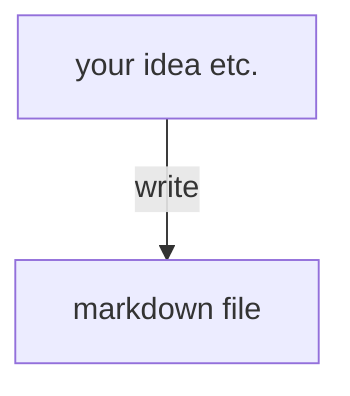
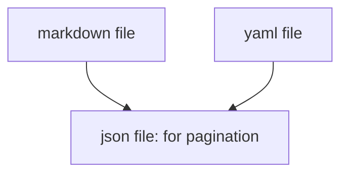
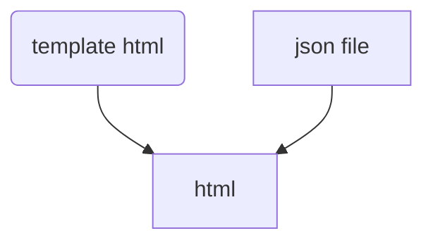
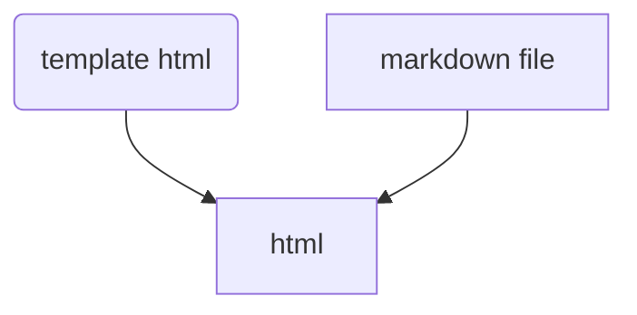

### propose 

From .md & config file to generate a static blog, 
looks like jekyll but much more fast than jekyll. 
```md-doc-generator``` do not generate static html, use template to fetch markdown files instead.
For pagination, it will generate .json files to hold page information.

### advantage

+ Much more smaller size than jekyll.
+ Much more less time to generate content.(only generate pagination info in .json files)
+ No need DB, just static content. Safe & fast.

### disadvantage

Not good for SEO.  
Search engine bot may cannot recognize your blog content.

### how to use it

(1) Write your own template html file, include our js file in the head.
(2) Every time finish your markdown, just run command once.
  + I recommend use git to manage your markdown files, and use hook to run command every time.

### todo list

+ [] use .yaml / .toml file to config
  - [] .md should have category
+ [] use cli automato to generate static .json 
  - [] .json should contains .md urls
  - [] .json should contains pagination info. 
      eg., **blog-1.json** contains page-1 info, **blog-2.json** contains page-2 info
+ [] use fetch to get .md file
+ [] use [marked](https://github.com/markedjs/marked) to generate html dynamicly
  - [] should have a template html


### User Write Blog Flow



### Ggenerator Flow (Cli Automaton)



### Browser Access Flow

#### pagination


#### post


