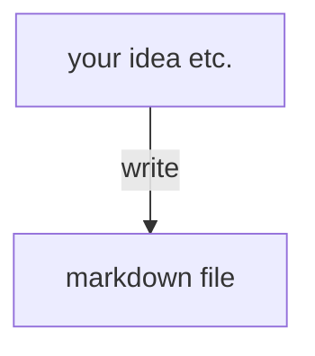
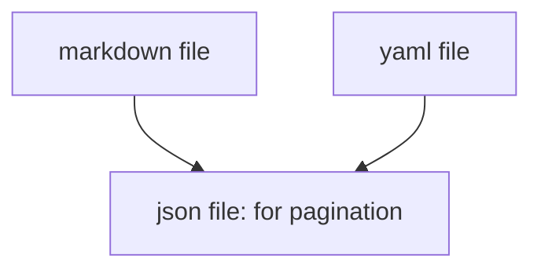
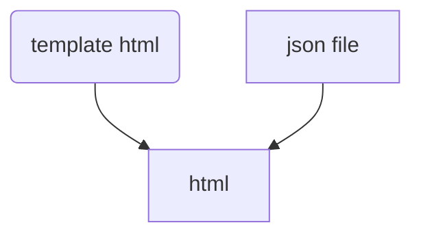
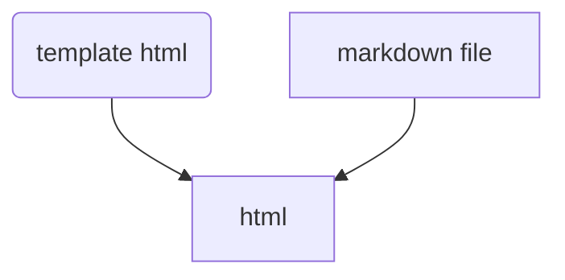

### propose 

from .md & config file to generate a static blog, 
like jekyll but do not generate static html, generate .json instead.
and use fetch() to get page info from .json, get content info from .md.

### advantage

Much more smaller size than jekyll.
Much more less time to generate content.(Json Mode Only: only generate pagination info .json)

### disadvantage

Not good for SEO.  
Search engine bot may cannot recognize your blog content.

### todo list

+ [] use .yaml / .toml file to config
  - [] .md should have category
+ [] use cli automato to generate static .json 
  - [] .json should contains .md urls
  - [] .json should contains pagination info. 
      eg., **blog-1.json** contains page-1 info, **blog-2.json** contains page-2 info
+ [] use fetch to get .md file
+ [] use ```marked``` to generate html dynamicly
  - [] should have a template html


### User Write Blog Flow



### Ggenerator Flow (Cli Automaton)



### Browser Access Flow

#### pagination


#### post


